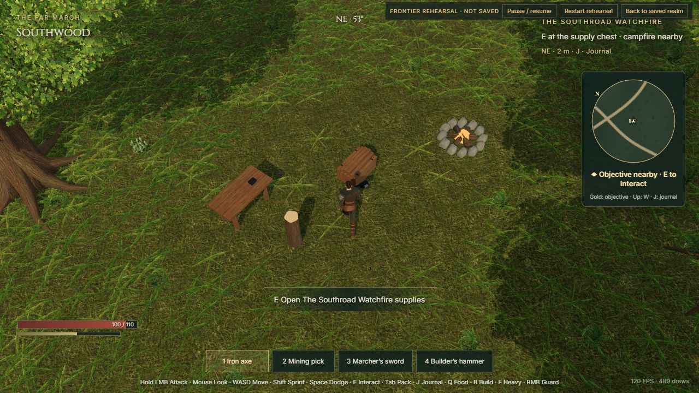

# Alderwatch — The Far March

A playable browser-based medieval survival/action RPG in development. Three.js, Rapier, TypeScript and Vite. Local single-player realm; multiplayer is not implemented.

## Run

Use Node.js 22.12 or later (Node 22 LTS recommended).

```sh
npm ci
npm run dev
```

Open http://127.0.0.1:5190/. The server deliberately refuses to switch ports if 5190 is occupied: reuse the existing server or stop it first. Save data is browser-local and tied to the origin; cloning this repo does not transfer a saved realm.

```sh
npm test
npm run build
npm run preview
```

Production preview uses port 5191 (a different save origin). Public game assets are included; no Blender, MCP, API key, or asset-generation step is needed to build/play. The main bundle currently produces a size warning.

## Controls and play

WASD move, mouse look, wheel zoom, Shift sprint, Space dodge, left mouse attack/tool (hold to chain), right mouse guard, F heavy attack, E interact/pick up, 1–4 equipment, Tab inventory, B build, C craft, J/M journal, Q prepared food, Escape menu/release cursor.

Start with the opening objectives, gather physical drops, craft at the village workbench, cook at the fire, and use the journal to track bounty/expedition/frontier destinations. Gold minimap markers show the tracked objective. Development-only isolated fixtures: `/?rehearsal=frontier`, `nature`, `combat`, `house`, or `expedition`. Rehearsal progress is NOT SAVED.

## Continue development

Start with [the ChatGPT handoff](HANDOFF_CHATGPT.md), [AGENTS.md](AGENTS.md), [full vision](GAME_VISION.md), [slice requirements](VERTICAL_SLICE.md), and the newest [checkpoint](DEVELOPMENT_STATE.md). Prior checkpoints are history, not today's status. [Asset credits](ASSET_CREDITS.md).

Reference art lives in `art/concepts/` and `art/direction-v2/`. It is a visual target, not a screenshot of the finished game. Current gameplay:



## What is included

Source, tests, lockfile, optimized runtime GLBs/WebPs, generated source textures and reference art, asset-authoring scripts. Large Blender masters/raw exports/downloaded source packs under `assets/source/` remain on the original workstation and are excluded. Authoring scripts are archival/local tools with workstation-specific paths; asset rebuilding needs those sources. See the handoff before using them.

CI checks test/build on pushes and pull requests. Passing tests is not visual acceptance or a complete playthrough. Art polish, performance validation, house/camp walkthroughs and the broader game vision remain unfinished.

## Villager dialogue

Three villagers stand in Alderbrook — Rowan Ash (blacksmith), Maerin Vale (cook) and
Hallis Crow (warden). Walk within a couple of paces and press `E` to speak; they answer
in their own words.

The browser holds no credential. It posts an npc id and a line of player speech to
`/api/npc`, and `server/npc-server.mjs` attaches the persona and the OpenRouter key.
Personas live in `server/personas.mjs` and never reach the bundle, so a player cannot
substitute a prompt of their own.

Run it locally alongside `npm run dev` (Vite proxies `/api` to port 5011):

```
npm run npc          # reads OPENROUTER_API_KEY from .env.local, which is gitignored
```

In production the service is a systemd unit (`alderwatch-npc.service`) reading
`/etc/alderwatch/secrets.env`, which only root can read; Caddy routes `/api/*` to it.
Requests are capped at 20 per minute per IP.
