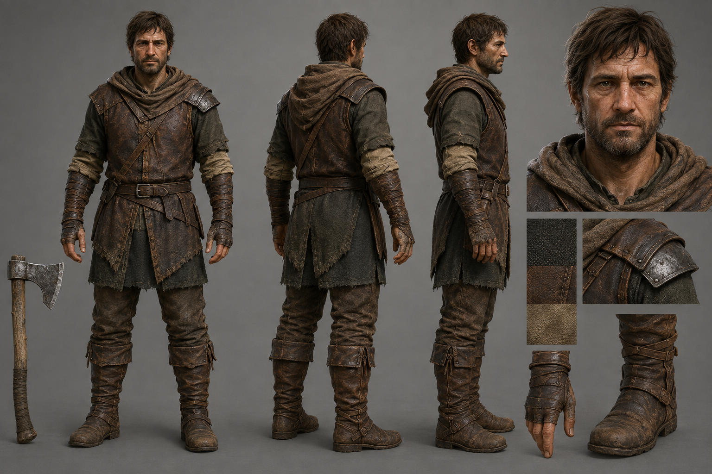
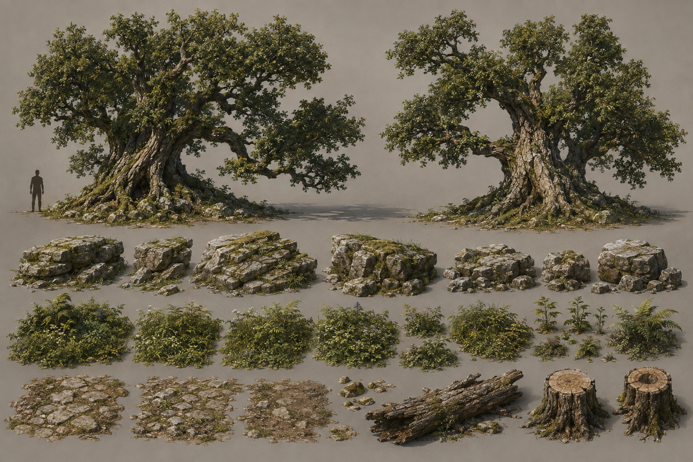
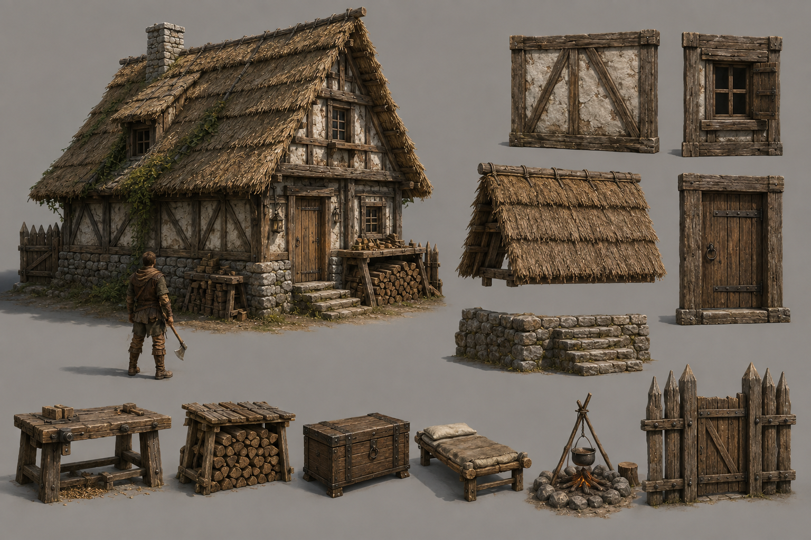
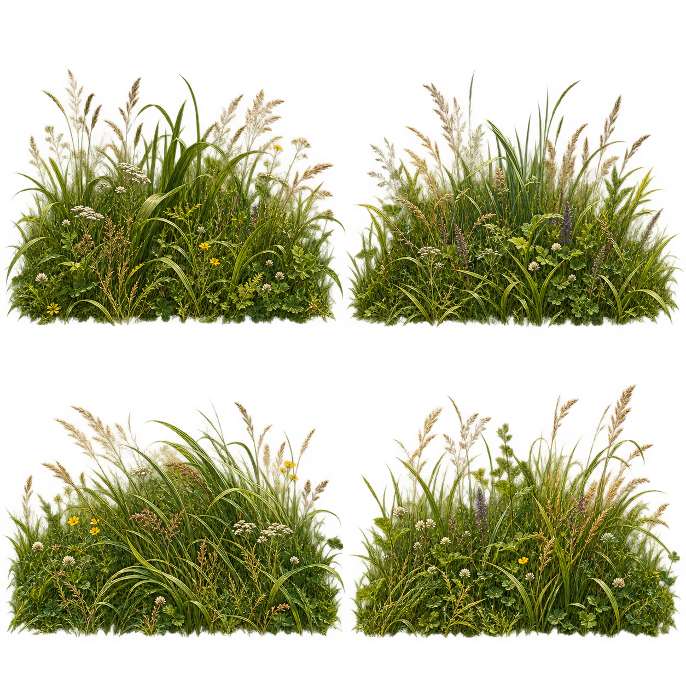
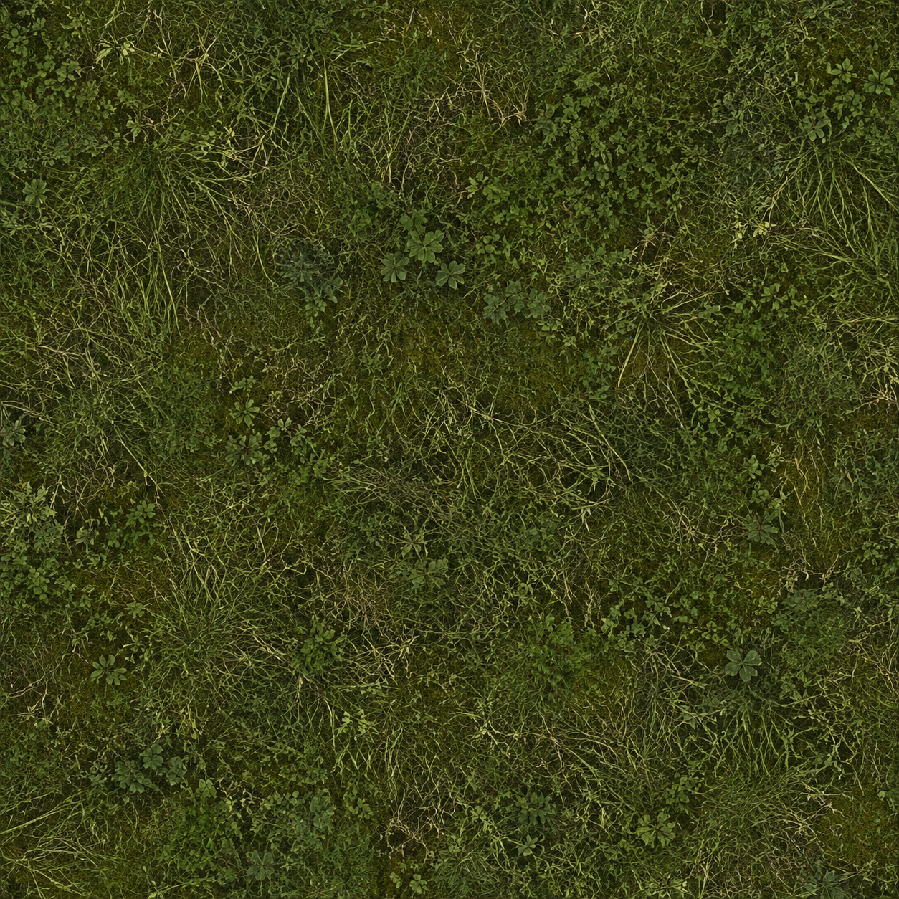
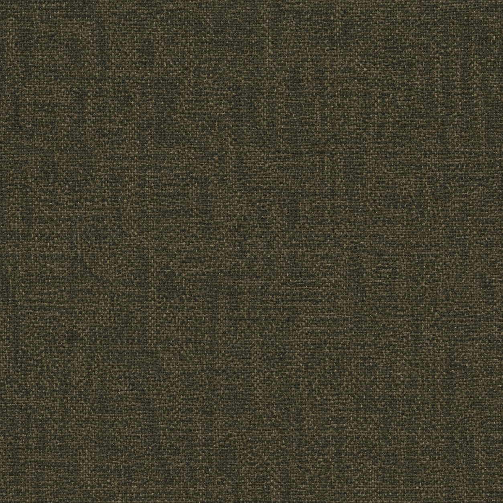
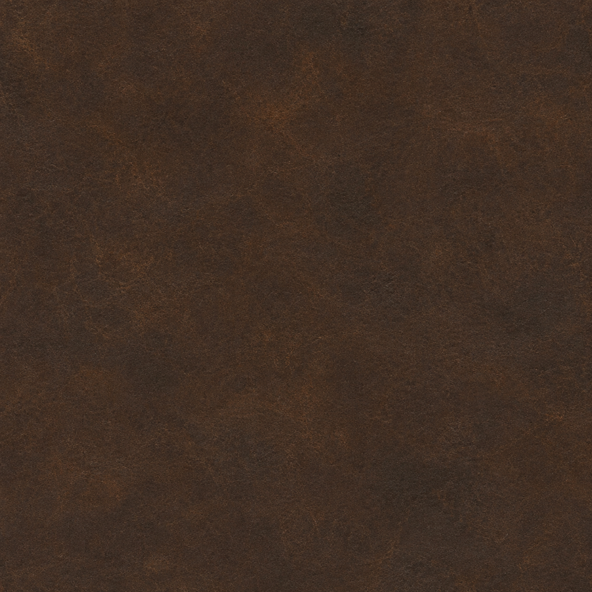

# Alderwatch — unified art set

User priority: generate the full coherent art set first, then apply it as one visual rebuild. Keep the accepted new fern foliage. The character and sparse grass are the leading problems. Do not resume piecemeal feature work or the house-controller investigation ahead of this art direction.

The approved `art/concepts/hero.png` and `settlement.png` remain the quality standard. These new sheets expand their production detail; they do not lower that standard.

## Package

- Character production turnaround: one rugged adult survivor, front/rear/side, face and equipment details; no youthful Robin Hood styling or decorative belt-heavy costume.
- Forest kit: mature crooked oak family, fractured limestone, rooted undergrowth and worn road design.
- Settlement construction kit: detailed cottage and matching modular walls, window, doorway, thick roof, foundation/steps and home props.
- Dense grass RGBA atlas: broad filled overlapping patches, not isolated tiny tufts.
- Dense meadow albedo: continuous low vegetation beneath the 3D grass.
- Charcoal-olive wool albedo: restrained weave and weathering for the survivor.
- Umber leather albedo: tactile aged leather for jerkin, gloves and boots.

All seven images are generated, visually inspected and saved here. They use built-in image generation, with no external provider, paid job, CLI fallback or API key. Exact prompts are in `PROMPTS.md`. The grass atlas has true alpha,619,884fully transparent pixels and no saturated red pixels above alpha127; low-alpha edge colors should still be checked after mipmapping. Seamlessness is prompted, not guaranteed.

**Replacement sweep applied, 2026-09-06:** generated grass/meadow/wool/leather textures now ship; the survivor has new skinned cowl/jerkin/beard geometry and tailored proportions; oak roots/crowns and timber/plaster house family follow the sheets. Accepted ferns and fixed skeleton/actions/sockets are preserved. Actual gameplay capture: `art/captures/approved-art-sweep.png`. This is not exact reference parity: adult facial/anatomical detail, procedural repetition and the remaining settlement props still need work. Build passes;44/45 tests pass, with the pre-existing house-entry failure unchanged.

## Character master

## Forest family

## Settlement family

## Dense ground cover

## Character surfaces

## Application order after the entire set is inspected

1. Rebuild character silhouette and clothing against the turnaround, preserving the repaired skeleton, animation continuity and hand sockets. Use the wool/leather materials without erasing seams or UV-defined details.
2. Replace the sparse dotted meadow with dense overlapping vegetation in deliberate clusters and continuous ground coverage. Retain clear road and building access. Keep the accepted fern assets.
3. Apply the forest and architecture sheets as coordinated mesh/material families, with consistent scale, palette and weathering.
4. Run the real game, capture the same viewpoints, compare with the approved art and repair the largest remaining mismatch. Concept art is not evidence that the game has been improved.

No runtime changes should be described as complete merely because this package exists.
